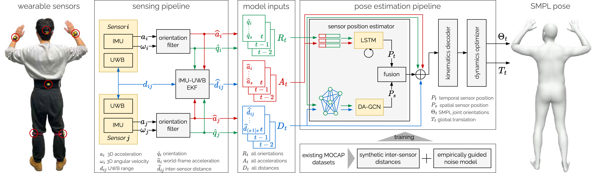

## Ultra Inertial Poser: Scalable Motion Capture and Tracking from Sparse Inertial Sensors and Ultra-Wideband Ranging (SIGGRAPH 2024)

[Rayan Armani](https://www.rayanarmani.com/about), [Changlin Qian](), [Jiaxi Jiang](https://jiaxi-jiang.com/), [Christian Holz](https://www.christianholz.net)<br/>

[Sensing, Interaction & Perception Lab](https://siplab.org), Department of Computer Science, ETH Zürich, Switzerland <br/>


<p align="center">

</p>

___________

Our method **Ultra Inertial Poser** estimates 3D full body poses and global translation (i.e., SMPL parameters) from the inertial measurements on a sparse set of wearable sensors, augmented and stabilized by the estimated inter-sensor distances based on **UWB ranging**. Our lightweight standalone sensors stream **raw IMU signals**, from which we estimate each tracker's 3D state and fuse it with acceleration and inter-sensor distances in a graph-based machine learning model for pose estimation.
<p align="center">

</p>


Abstract
----------
While camera-based capture systems remain the gold standard for recording human motion, learning-based tracking systems based on sparse wearable sensors are gaining popularity.
Most commonly, they use inertial sensors, whose propensity for drift and jitter have so far limited tracking accuracy.
In this paper, we propose *Ultra Inertial Poser*, a novel 3D full body pose estimation method that constrains drift and jitter in inertial tracking via inter-sensor distances.
We estimate these distances across sparse sensor setups using a lightweight embedded tracker that augments inexpensive off-the-shelf 6D inertial measurement units with ultra-wideband radio-based ranging—dynamically and without the need for stationary reference anchors.
Our method then fuses these inter-sensor distances with the 3D states estimated from each sensor.
Our graph-based machine learning model processes the 3D states and distances to estimate a person's 3D full body pose and translation.
To train our model, we synthesize inertial measurements and distance estimates from the motion capture database AMASS.
For evaluation, we contribute a novel motion dataset of 10 participants who performed 25 motion types, captured by 6 wearable IMU+UWB trackers and an optical motion capture system, totaling 200 minutes of synchronized sensor data (UIP-DB).
Our extensive experiments show state-of-the-art performance for our method over PIP and TIP, reducing position error from 13.62 to 10.65 $cm$ (22% better) and lowering jitter from 1.56 to 0.055 $km/s^3$ (a reduction of 97%).


Method Overview
----------
The person is wearing 6 sensor nodes, each featuring an IMU and a UWB radio. Our method processes the raw data from each sensor to estimate sequences of global orientations, global accelerations, and inter-sensor distances. These serve as input into our learning-based pose estimation to predict leaf-joint angles as well as the global root orientation and translation as SMPL parameters.
<p align="center">

</p>

Code
----------

#### Dependencies

1. Create a new conda environment and install pytorch:

   ```bash
   conda env create -f environment.yml python=3.8
   conda activate UIP
   ```

2. Download SMPL body model from [SMPL](https://smpl.is.tue.mpg.de/). Put them in the `./data` folder. Please download the version 1.0.0, which contains neutral humanoid `basicmodel_m_lbs_10_207_0_v1.0.0.pkl`.
3. Install Rigid Body Dynamics Library [rbdl](https://github.com/rbdl/rbdl).
4. Prepare test dataset

   
   1. Download DIP-IMU dataset from [DIP](https://dip.is.tue.mpg.de/).
   2. Download TotalCapture dataset from [TotalCapture](https://cvssp.org/data/totalcapture/).
   3. In `config/config.py` , set `path.raw_dipimu_dir` to the DIP-IMU dataset path; set `paths.raw_totalcapture_dip_dir` to the Total Capture SMPL poses path; and set `paths.raw_totalcapture_official_dir` to the TotalCapture official ground truth path.
5. Download pretrained weights:

   
   1. Download pre-trained weights from [here](https://drive.google.com/drive/folders/151pmZSRl_bEu5eJgu1V9SdjE-x7FtACz?usp=sharing).

#### Evaluation

To run the evaluation, we first process our test dataset by running:

`python modules/dataset/preprocess.py`

Then, we could run an evaluation of our model by

```bash
python modules/evaluate/evaluator.py --network UIP\
                    --ckpt_path /path/to/model.pt\
                    --data_dir /path/to/preprocessed_dataset\
                    --eval_trans\
                    --normalize_uwb\
                    --flush_cache\
                    --add_guassian_noise\
                    --model_args_file config/model_args.json\
                    --eval_save_dir output/evaluation_res
```

`/path/to/preprocessed_dataset` is the folder that contains the processed  data `test.pt` .

#### Visualization

We use [aitviewer](https://github.com/eth-ait/aitviewer) to visualize our results by running the following:

`python visualizer/visualize_result.py --seq_res_path "data/result/[dataset_name]/[model_name]" --seq_id X`

Dataset
----------
Please stay tuned for the release of our UIP-DB dataset!

Citation
----------
If you find our paper or codes useful, please cite our work:

    @article{armani2024ultra,
       title={Ultra Inertial Poser: Scalable Motion Capture and Tracking from Sparse Inertial Sensors and Ultra-Wideband Ranging},
       author={Armani, Rayan and Qian, Changlin and Jiang, Jiaxi and Holz, Christian},
       journal={arXiv preprint arXiv:2404.19541},
       year={2024}
     }


License and Acknowledgement
----------
This project is released under the MIT license. Our code is partially based on [PIP](https://github.com/Xinyu-Yi/PIP).
